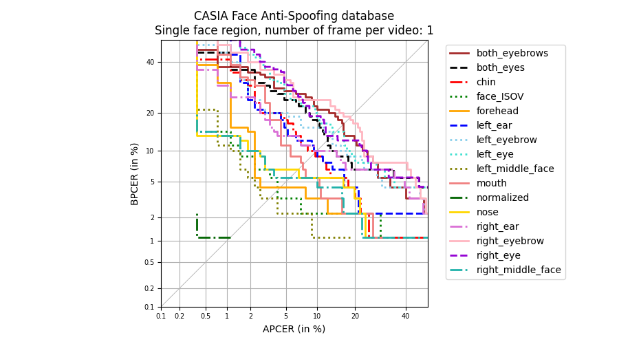

# Facial-Regions-for-Presentation-Attack-Detection
02238 course project

**Task description**: see [task-description](./RPA-task-description.pdf)

## Dataset

related paper: https://ieeexplore-ieee-org.proxy.findit.dtu.dk/stamp/stamp.jsp?tp=&arnumber=6199754

There are 50 subjects in this dataset. For each subject, there are 12 videos with low, mid, high quality. And it contains 3 kinds of attack: warped photo attack, cut photo attack, and video attack.

## Mission Completion Step-by-step

1. scripts for {video2frames, face detection, facial alignment}

   1. extract frames using cv2

      ​	store in *train_frames* folder

   2. extract normalized face image using landmarks

      * detect 81 landmarks (ref: https://github.com/italojs/facial-landmarks-recognition/blob/master/shape_predictor_68_face_landmarks.dat)
      * align the face image first according to interpupil distance and angle (affine operation)
      * crop the image to normalized one according to ISO/IEC 19794-5

      store in *train_normalized* folder

      **crop error on video type 2,5,6**

2. scripts for extract different facial regions 

   normalized face with shape (width: 300, height: 400)

   

   | ID   | Facial Region     | landmark(s) for determining the center | bounding box |
   | :--- | ----------------- | -------------------------------------- | ------------ |
   |      |                   |                                        |              |
   | 1    | Chin              | 5                                      | 75 x 181     |
   | 2    | Left ear          | (1,2)                                  | 75 x 51      |
   | 3    | Right ear         | (14,15)                                | 75 x 51      |
   | 4    | left eyebrow      | (17-21)                                | 51 x 75      |
   | 5    | right eyebrow     | (22-26)                                | 51 x 75      |
   | 6    | both eyebrows     | (21,22)                                | 51 x 151     |
   | 7    | left eye          | (36-41)                                | 51 x 51      |
   | 8    | right eye         | (42-47)                                | 51 x 51      |
   | 9    | both eyes         | (39,42)                                | 51 x 151     |
   | 10   | Face ISOV         | (30)                                   | 192 x 168    |
   | 11   | Forehead          | (21,22) as bottom center               | 101 x 151    |
   | 12   | Left middle face  | 30 as right center                     | 173 x 106    |
   | 13   | Right middle face | 30 as left center                      | 173 x 106    |
   | 14   | Mouth             | (61-63,65-67)                          | 51 x 101     |
   | 15   | Nose              | 29                                     | 101 x 75     |

   

3. scripts for PAD approach (better not too computational consuming) 

   1. some reference ideas:
      * [use only a single frame, based on color space histogram](https://github.com/ee09115/spoofing_detection) might not be so suitable for our case
      * the easiest way: extract features (not sure what features) from frames and than use classifier.
      * we could start with for example 10 video (or even 5) for training and 5 for testing, to reduce the computational cost for now. (notice the video quality and PA type)
      * Handbook might has some clues for where to start
   2. possible ideas (steps)
      1. DL structure: resnet18 
      2. reduce data size (one from every 10 frames)
      3. only use the train set for pilot trails, 15 subjects for training & 5 for testing
      4. on normalized face & 15 regions respectively 
   3. updated to-do-list (6.18 night)
      1. extract frame and face regions for testing set (5 frames each video maybe?) (done)
      2. run the resnet18 model and see whether it is too good (done)
      3. whether need other dataset (ask for that via email)

4. experiment design 

   1. ideas: known attack + challenges on unknow attack types

   2. ablation study on facial regions

   3. fusion study (refer on the first reference)

      

5. analyze on the result (DET, EER etc.)

## Update to-do-list (some neeeeed-implemented ideas)

1. #function01 visualization the layers (CAM, class activation mapping), might be interesting

2. #bug05 (fixed) ~~regions imgs &  normalized imgs might not come from the same frame (caz we take them randomly from the folder)~~

   ~~possible dealing ways:~~

   * ~~get the all txt files at one time~~
   * ~~random seed~~

3. #issue05 overqualified performance with deep learning 

4. #function02 **ONGOING** fusion on face regions (feature-fusion, add one more fc layer)

   basically done

   need experiments (face_isov+right_mid_face -> accuracy 0.98+)

   #enhancement now we can choose the best epoch for DET curve based on ('train_loss')

   

   | domain region | added region      | EER (%)  | accu_test |
   | ------------- | ----------------- | -------- | --------- |
   | face_ISOV     | -                 | 2.65     | -         |
   |               | both_eyebrows     | 2.87     | 0.9713    |
   |               | both_eyes         | 3.25     | 0.9657    |
   |               | chin              | **1.75** | 0.9781    |
   |               | left_ear          | 3.47     | 0.9674    |
   |               | left_eyebrow      | 3.32     | 0.9680    |
   |               | left_eye          | 3.55     | 0.9192    |
   |               | left_middle_face  | 3.32     | 0.9556    |
   |               | nose              | **1.68** | 0.9848    |
   |               | right_ear         | 4.44     | 0.9495    |
   |               | right_eyebrow     | 3.55     | 0.9635    |
   |               | right_eye         | 2.58     | 0.9764    |
   |               | right_middle_face | 2.87     | 0.9764    |
   |               | forehead          | 2.8      | 0.9702    |
   |               | mouth             | 3.06     | 0.9669    |

   [face_ISOV,nose] + 3rd region:

   | domain regions   | added region      | EER(%)   | accu_test |
   | ---------------- | ----------------- | -------- | --------- |
   | [face_ISOV,nose] | -                 | **1.68** | 0.9848    |
   |                  | both_eyebrows     |          |           |
   |                  | both_eyes         |          |           |
   |                  | chin              |          |           |
   |                  | forehead          |          |           |
   |                  | left_ear          |          |           |
   |                  | left_eyebrow      |          |           |
   |                  | left_eye          |          |           |
   |                  | left_middle_face  |          |           |
   |                  | mouth             |          |           |
   |                  | right_ear         |          |           |
   |                  | right_eyebrow     |          |           |
   |                  | right_eye         |          |           |
   |                  | right_middle_face |          |           |
   |                  |                   |          |           |

   

5. #trails01  **DONE** ~~experiment on 1/2/5 frame each video and compare the result~~

   could be observed that the performance is much better and stable compare with the num_of_frame = 1

   **Below is the result with num_of_frame = 5 for each video clip**

   normalized is not shown caz the EER is 0.00

   

   | num_of_frame=5 | face region       | EER (%)  |
   | -------------- | :---------------- | -------- |
   |                | both_eyebrows     | 9.15     |
   |                | both_eyes         | 8.03     |
   |                | chin              | 8.92     |
   |                | face_ISOV         | **2.65** |
   |                | forehead          | 4.67     |
   |                | left_ear          | 5.79     |
   |                | left_eyebrow      | 11.72    |
   |                | left_eye          | 12.02    |
   |                | left_middle_face  | 2.43     |
   |                | mouth             | 7.05     |
   |                | nose              | 3.77     |
   |                | right_ear         | 7.13     |
   |                | right_eyebrow     | 11.35    |
   |                | right_eye         | 10.94    |
   |                | right_middle_face | 4.18     |
   |                |                   |          |
   |                | normalized        | 0.00     |

   

6. #function03 **DONE** ~~APCER and BPCER~~ & ~~DET curve (**urgent, confused**)~~

   about how to get the DET curve:

   first of all you need a PAD score. In previous studies, 

   * whether they use SVM
   * or weird designed score (not suitable in our case)
   * use softmax result but not plot DET only ROC

   concerns about using softmax result: not smooth enough (centralized in 0.1 and 0.9)

   **Done**: using the softmax result as score. DET plots over different face region:

   

7. #other01  **DONE** ~~deploy the experiment in DTU clusters~~

8. #trails02 other datasets 

   face alignment & region extraction has done, training needs to be done

9. #function04  **DONE** ~~need to get EER (with certain number) and make a chart~~ 

   

## Might-interesting Ideas

- fusion on facial regions 
- unknown attack + facial region 
- cross database, might be hard and time-consuming 
