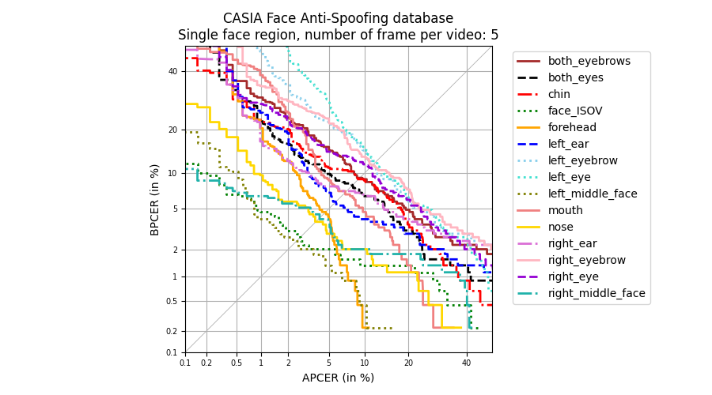

# Facial-Regions-for-Presentation-Attack-Detection

02238 course project

Nina Weng s202997

**Task description**: see [task-description](./RPA-task-description.pdf)

## About The Project

This is a course project for DTU course 02238 Biometics system. In this work, we analyze the performance of different fa-cial regions in PAD. First, we introduce an algorithm for facial regions extraction, extracting 15facial regions, including particular facial components, local facial regions, and global facial regions. Then a feature-level fusion CNN is implemented for PAD. We perform the task on two databases and then analyze the results based on Detection Error Tradeoff (DET) curve and Equal Error Rate(EER). 

## Getting Started

### Prerequisites

see [requirement.txt](./requirements.txt)

GPU is recommended.

### Functions

Functions are realized inside *scripts* folder. 

* *scripts/pre-processing*: functions for face normalization, face region extraction, frame extraction and building training/testing list (for Dataloader in training process).
* *scripts/model*: contains the models used in this work.
* *scripts/analysis*: contains the functions about DET curve drawing and feature map visualization.

### Other folders

* train_test_info: store the list for training/testing process 

* results: store the output scores for DET analysis, and feature map, and some plots

* pretrained_models: contains pre-trained models for landmark detection.

  

## Results

Landmarks detection:

Facial region extraction:

DET curves:

Feature map visualization:

## Contact

Nina Weng, s202997(at)student.dtu.dk
